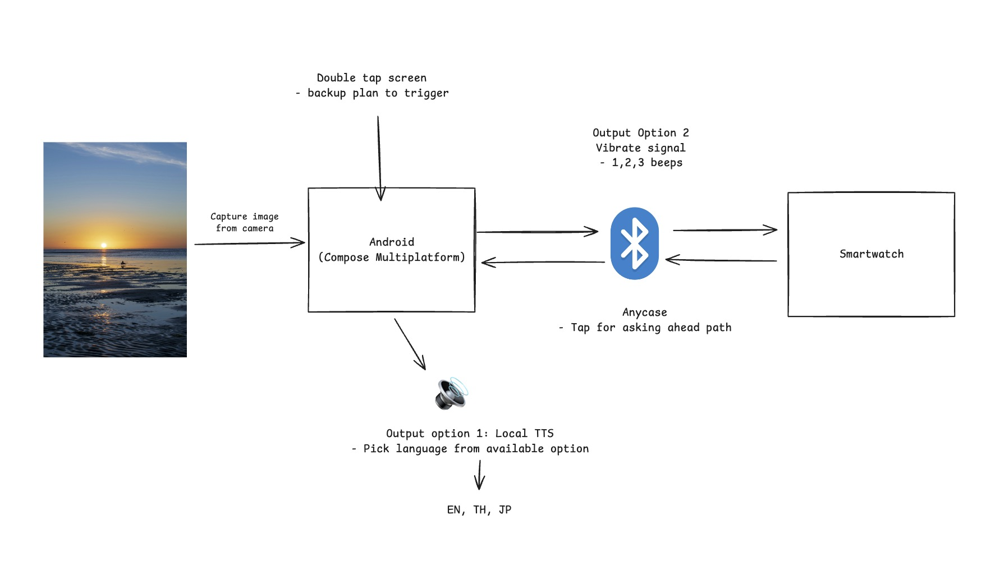
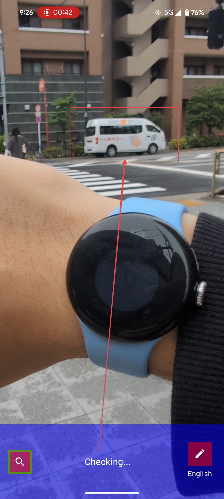
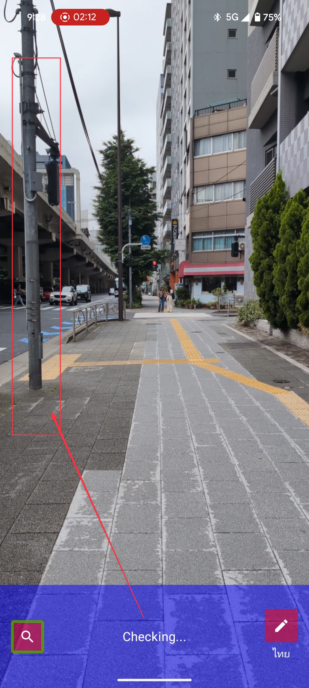

# Blind-Friendly-v2

This is a mobile app that helps visually impaired people navigate their environment.

## Objectives

Capability to use LLM navigate people via phone without internet connection

## Architecture

## Tech Stack

- Jetpack Compose (Mobile, WearOS)
- Gemma 3n

## Demo

### Video

### Result

Please note that when I tested, I accept how latency will be high due to computation is rely on mobile device.

#### Demo 1

Distance: 10 meters

Time: ~30 seconds

#### Demo 2

Distance: 2 meters

Time: ~40 seconds

## Key takeaways

- Verify capability of Gemma 3n on mobile device without internet connection
- However, I believe my Pixel 8 Pro is not powerful enough to run Gemma 3n (Multimodal)
- User experience is not good enough with 30-40 seconds delay.
- Anyway, I believe we enable to use LLM on other task without internet connection and perform as asynchronously.
  - Example 1: Text generation
  - Example 2: Image analysis with asynchronous design

## Other resources

Resources related to the project.

- [Gemma 3n](https://deepmind.google/models/gemma/gemma-3n/)
- [Gemma 3n model overview](https://ai.google.dev/gemma/docs/gemma-3n)
- [google/gemma-3n-E2B-it-litert-preview](https://huggingface.co/google/gemma-3n-E2B-it-litert-preview)
- [LLM Inference guide for Android](https://ai.google.dev/edge/mediapipe/solutions/genai/llm_inference/android)
- [Android Developer - Bluetooth overview](https://developer.android.com/develop/connectivity/bluetooth)